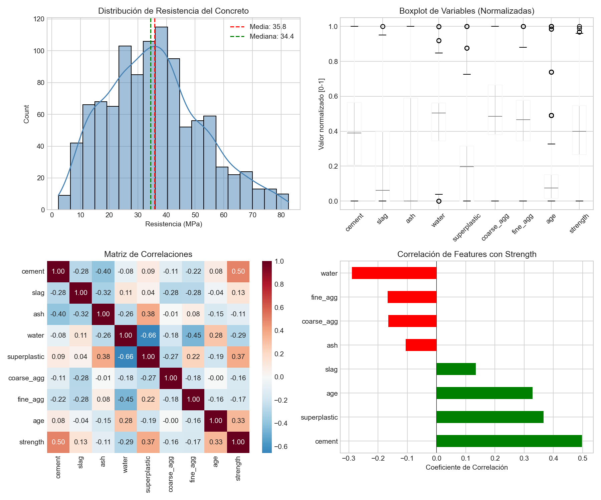
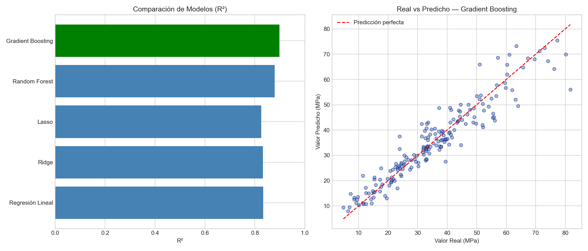
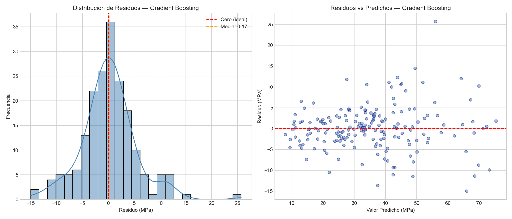

# Prediccion de Resistencia del Concreto

Proyecto de Machine Learning que predice la resistencia a compresion del concreto (MPa) a partir de sus componentes de mezcla. Incluye un pipeline completo desde el analisis exploratorio hasta el despliegue como aplicacion web.

## Dataset

**Concrete Compressive Strength** de [Sina Mehdinia en Kaggle](https://www.kaggle.com/datasets/sinamhd9/concrete-comprehensive-strength), basado en el repositorio UCI Machine Learning.

- 1030 observaciones, 8 variables independientes + 1 variable objetivo
- Variable objetivo: resistencia a compresion (`strength`, en MPa)

| Variable | Descripcion |
|---|---|
| `cement` | Cemento (kg/m3) |
| `slag` | Escoria de alto horno (kg/m3) |
| `ash` | Ceniza volante (kg/m3) |
| `water` | Agua (kg/m3) |
| `superplastic` | Superplastificante (kg/m3) |
| `coarse_agg` | Agregado grueso (kg/m3) |
| `fine_agg` | Agregado fino (kg/m3) |
| `age` | Edad del concreto (dias) |

## Estructura del Proyecto

```
├── concrete.py           # Pipeline completo (EDA, features, modelado, evaluacion)
├── app.py                # Aplicacion web Streamlit
├── predictor.py          # Predictor por linea de comandos
├── Concrete_Data.xls     # Dataset original
├── objetivo.ipynb        # Plan del proyecto
├── eda_visualizaciones.png
├── modelos_comparacion.png
├── evaluacion_residuos.png
├── requirements.txt
└── README.md
```

## Pipeline

### Fase 1: Analisis Exploratorio (EDA)
- Estadisticas descriptivas, distribucion de la variable objetivo
- Matriz de correlaciones: `cement` y `superplastic` con mayor correlacion positiva; `water` y `fine_agg` con mayor correlacion negativa
- Deteccion de multicolinealidad entre `water` y `superplastic` (r = -0.66)

### Fase 2: Ingenieria de Features
- Eliminacion de outliers con metodo IQR
- Analisis de multicolinealidad (VIF)
- Ratios: `water_cement_ratio`, `fine_coarse_ratio`, `supp_cement_ratio`
- Interacciones: `cement_superplastic`, `cement_age`, `water_cement_product`
- Transformacion logaritmica en variables con alta asimetria
- Escalado con StandardScaler

### Fase 3: Modelado
Se entrenaron y compararon 5 modelos de regresion:

| Modelo | R2 | RMSE | MAE |
|---|---|---|---|
| Regresion Lineal | Baseline | - | - |
| Ridge (L2) | - | - | - |
| Lasso (L1) | - | - | - |
| Random Forest | - | - | - |
| **Gradient Boosting** | **Mejor** | - | - |

> Ejecuta `python concrete.py` para ver las metricas exactas con el dataset completo.

### Fase 4: Evaluacion
- Validacion cruzada 5-fold
- Analisis de residuos del mejor modelo
- Conclusiones y resumen del pipeline

## Visualizaciones

### EDA


### Comparacion de Modelos


### Analisis de Residuos


## Como Usar

### Requisitos
```bash
pip install -r requirements.txt
```

### 1. Ejecutar el pipeline completo
Genera el modelo entrenado y todas las visualizaciones:
```bash
python concrete.py
```

### 2. Aplicacion web (Streamlit)
```bash
streamlit run app.py
```
Se abre en el navegador una interfaz donde ingresas los componentes de la mezcla y obtienes la prediccion de resistencia.

### 3. Predictor por terminal
```bash
python predictor.py
```
Interfaz interactiva en la terminal para hacer predicciones.

> **Nota:** Antes de usar `app.py` o `predictor.py`, debes ejecutar `concrete.py` al menos una vez para generar el archivo `modelo_concreto.pkl`. La exportacion del modelo esta comentada al final de `concrete.py`; descomentala para habilitarla.

## Tecnologias
- Python 3.14
- pandas, NumPy, Matplotlib, Seaborn
- scikit-learn (LinearRegression, Ridge, Lasso, RandomForest, GradientBoosting)
- statsmodels (VIF)
- Streamlit
- joblib
